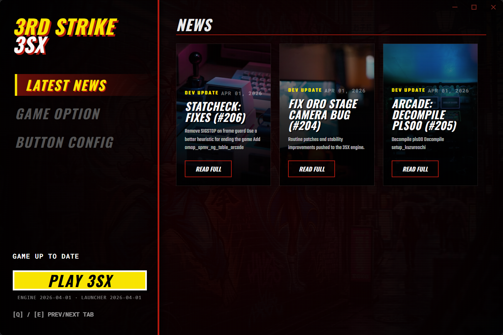
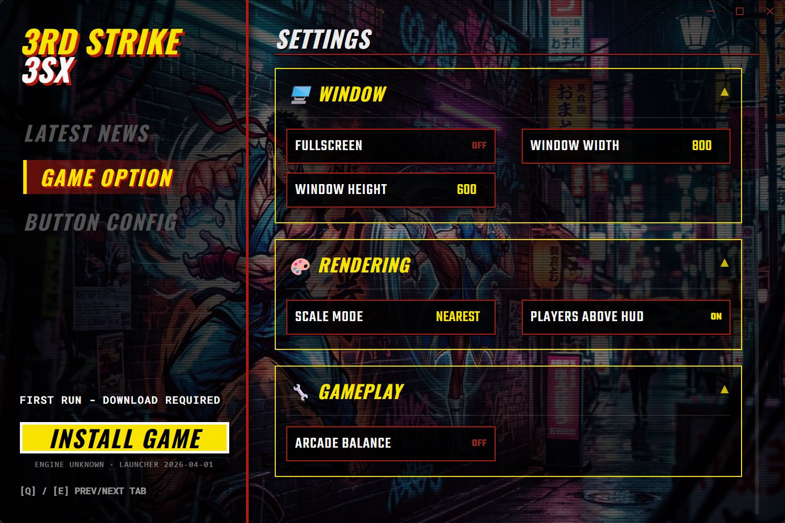
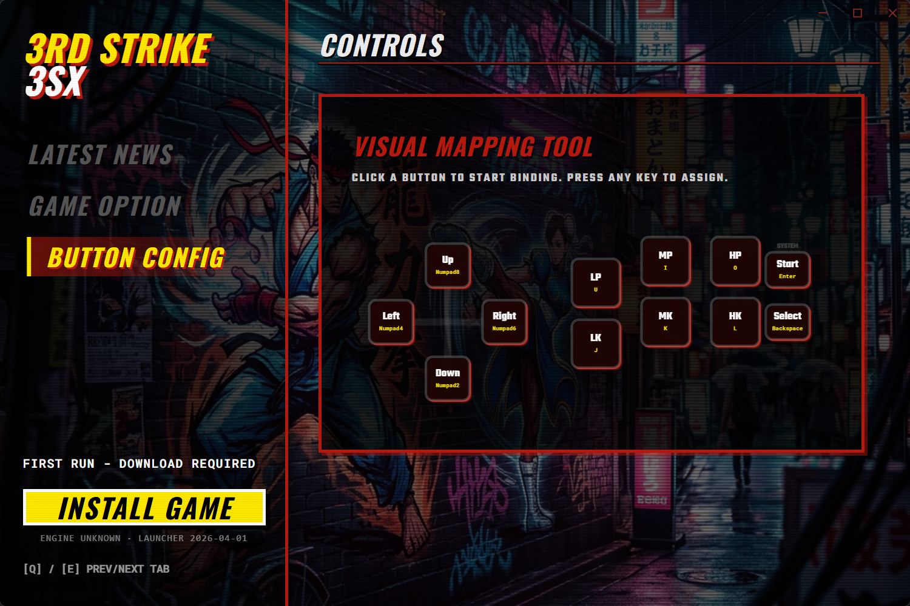

# 3SX Launcher

A custom companion launcher for the **3SX engine** (Street Fighter III: 3rd Strike Open Port). Built with lightning-fast Rust (Tauri 2) and React, this launcher handles seamless engine updates, input configuration, and game settings—styled with a premium arcade aesthetic.

## Features

- **One-Click Updates**: Directly hooks into the `crowded-street/3sx` GitHub Releases API to fetch, verify, and unpack the latest engine updates.
- **Native Configuration**: Automatically parses and modifies the official flat `config` key/value system.
- **Live News Feed**: Automatically pulls recent commit activity to keep players informed on development progress.
- **Zero-Bloat**: A self-contained, standalone desktop UI weighing only a few megabytes with extremely low RAM usage.
- **Arcade Aesthetic**: Handcrafted UI with custom animations, typography, and CRT styling.

## Screenshots





## Architecture Stack

- **Tauri 2** (Rust) for the minimal, highly secure backend.
- **React 19 + TypeScript** for UI state and interactivity.
- **Vite** for the blistering fast frontend build pipeline.

## Getting Started

### Prerequisites

Ensure you have the following installed:
- [Node.js](https://nodejs.org/en/) (v20+ recommended)
- [Rust](https://rustup.rs/) (latest stable)
- Build tools (Visual Studio Build Tools for Windows, or standard cc/clang for Linux/Mac)

### Development

Install the Node.js frontend dependencies:

```bash
npm install
```

Run the launcher in hot-reloading development mode:

```bash
npm run dev
```

*Note: In development mode, the launcher will map its root directory based on the `package.json` location and place game files/downloads within the project structure for easy debugging.*

### Production Build

To compile a highly optimized, statically linked production executable:

```bash
npm run tauri build
```

Once the Rust linker completes, you will find your output binaries (Executable, MSI installers) inside `/src-tauri/target/release/`.

## macOS

The engine is a separate `3sx.app` that the launcher downloads via its
updater, pulling the latest stable build from the `gootecks/3sxtra` GitHub
Releases API (`/releases/latest`, universal `3SX-<sha>-macos-universal.zip`).
It locates the newest installed `3sx.app` (by
`Contents/Resources/ENGINE_VERSION`, missing = oldest) found in, in order:
`~/Library/Application Support/CrowdedStreet/3SX/engine/`, inside the launcher
bundle at `Contents/Resources/engine/`, beside the launcher app,
`/Applications`, `~/Applications`. The game is started with `open -n`; its
output goes to `~/Library/Application Support/CrowdedStreet/3SX/logs/`.

## Release Notes

Release notes are generated with [Communiqué](https://github.com/jdx/communique) — see [`docs/release-notes.md`](docs/release-notes.md) for usage. This tooling handles notes only; tags, builds, and asset publishing are handled by the CI workflow.

## Legal

This launcher is an open-source tool built around the 3SX project. 
All trademarks and properties of Street Fighter III: 3rd Strike belong to their respective owners (Capcom). No copyrighted game assets are included in this repository.
