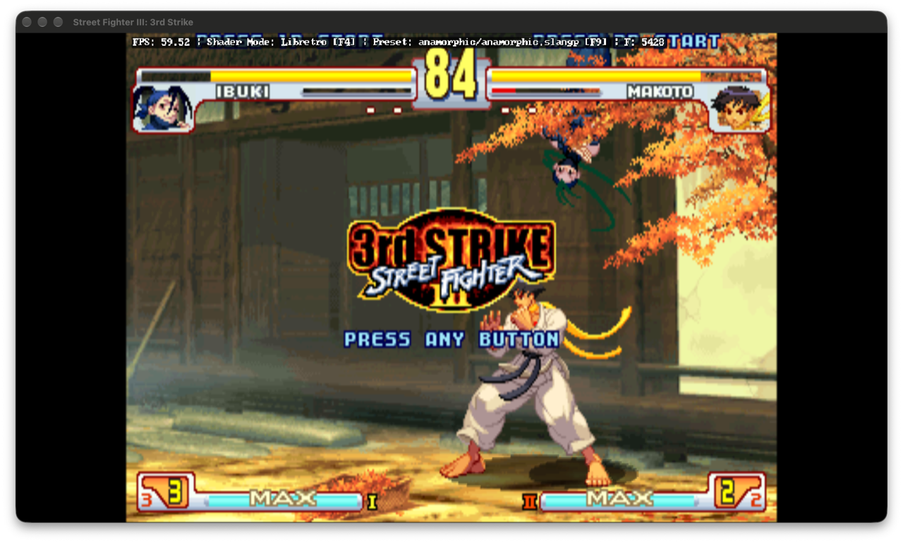

# Settings investigation: actual game checks

Audit date: October 7, 2026. This is an investigation, not a settings fix.

## Conclusion

The launcher and the installed engine used the **same config path**. The observed failures are not explained by the launcher saying “3SX” while the engine repository is named “3sxtra”. They are concrete value-format and lifecycle mismatches, plus engine settings with no startup reader.

- The UI writes boolean values as `1`/`0`; the engine requires literal `true`/`false`. A launcher-written `fullscreen=0` actually launched fullscreen.
- Startup-loaded configuration is not a live control interface. Edits made while the game runs are overwritten by the engine's next whole-file save; this was reproduced at exit.
- VSync is saved by the engine but never read at startup. Writing even the correct `vsync=true` token did not enable it in the tested OpenGL backend.
- Seven exposed training display flags are also never loaded into the runtime training settings. This finding is source-based, not a training-session visual test.
- The controls remapper uses the correct repeated `p1_mapping` key, but incompatible action and input **values**. There is no gamepad capture implementation.

All 28 launcher setting keys exist in the audited engine source. Nine integer/string/select controls have consumers, sometimes conditional; all 19 boolean controls are ineffective as launcher controls. “Has a consumer” is not a claim that every option was tested in gameplay. See the [complete setting matrix](settings.md).

## Versions and scope

| Item | Audited state |
| --- | --- |
| Launcher baseline | `596d1ed`, following the stable macOS updater merge |
| Engine launched | `/Applications/3sx.app`, build `2026-10-07T09:17:21Z`, version stamp `cc69ae0` |
| Engine source checkout | `9cd552a25c70ac97bfb637ca69ed3a020af86486` in the sibling `3sxtra` repository |
| Stable engine tag | `macos-v0.1.0`, stamp `d84b2a2`; not the installed engine stamp |
| Effective config | `~/Library/Application Support/CrowdedStreet/3SX/config` |
| ROM | Existing `resources/SF33RD.AFS`, 642,492,416 bytes |

The installed engine and audited source revision differ. Runtime results below establish what the installed build did; the broader support matrix describes the inspected source and must be rechecked against future releases. No engine update or ROM import was performed.

The launcher was built locally and its actual `save_config`/`get_config` native functions were exercised with a temporary Rust smoke harness. The game was opened through the launcher's real `--launch` path. This tests the native persistence and engine integration, **not GUI clicking or a synthetic frontend mock**.

## Observed checks

| Check | Saved value / action | Actual result |
| --- | --- | --- |
| Baseline launch | Existing `fullscreen=false`, width 1319, height 900 | Game opened and rendered; startup reported `1319x900`, `Fullscreen: 0` |
| Launcher boolean encoding | Native save of `fullscreen=0`, then launch | Native readback was `0`; engine reported `Fullscreen: 1` |
| Valid engine tokens | Native save of `fullscreen=false`, width 1280, height 720, then launch | Engine reported `1280x720`, `Fullscreen: 0`; CoreGraphics observed a 1280 × 752 window including titlebar |
| VSync | Native save of `vsync=true` before that launch | Engine reported `VSync: OFF (OpenGL, native pacing)` |
| Edit while running | Native save of `window-width=1111` | Native readback was 1111; the open game's window remained 1280 pixels wide |
| Exit overwrite | Terminated only that controlled game process with `SIGTERM` | Engine saved config; width reverted to 1280 and VSync to `false` |
| Restoration | After game shutdown, restored the original config | Original and restored files had identical SHA-256 hashes |

Selected startup evidence, excluding unrelated logs and identity values:

```text
Baseline:
SDLApp_Init: Creating window 1319x900, Fullscreen: 0, Backend: OpenGL

After native save fullscreen=0:
SDLApp_Init: Creating window 1319x900, Fullscreen: 1, Backend: OpenGL

After native save fullscreen=false, width=1280, height=720, vsync=true:
SDLApp_Init: Creating window 1280x720, Fullscreen: 0, Backend: OpenGL
VSync: OFF (OpenGL, native pacing)
```

The controlled 1280 × 720 run reached the title/attract screen and rendered at approximately 59.5 FPS. No injected keystrokes or controller events were used.



## Root-cause evidence

Engine links below refer to the audited source revision, not a promise of identical line numbers in every build.

### Boolean type mismatch

[Launcher `toggleBool`](../src/App.tsx) sends `1` or `0` and [native `save_config`](../src-tauri/src/lib.rs) persists the string supplied by the UI. Engine [`Config_Init`](https://github.com/gootecks/3sxtra/blob/9cd552a25c70ac97bfb637ca69ed3a020af86486/src/port/config/config.c#L350-L365) recognizes only `true` and `false` as boolean values. `0` and `1` become integers.

[`find_entry`](https://github.com/gootecks/3sxtra/blob/9cd552a25c70ac97bfb637ca69ed3a020af86486/src/port/config/config.c#L137-L160) substitutes a compiled default when the parsed value's type differs from a known default's type. For `fullscreen`, that default is `true`. Keys without a compiled default still fail the boolean getter's type check and return false. Thus the same UI encoding either preserves a default or forces false; it cannot correctly express both states.

### Startup snapshot and competing writers

The engine initializes its config once. [`Config_Save`](https://github.com/gootecks/3sxtra/blob/9cd552a25c70ac97bfb637ca69ed3a020af86486/src/port/config/config.c#L405-L423) rewrites the file from its in-memory entries. [`SDLApp_Quit`](https://github.com/gootecks/3sxtra/blob/9cd552a25c70ac97bfb637ca69ed3a020af86486/src/port/sdl/app/sdl_app.c#L1155-L1169) invokes it at exit. The launcher neither reloads the engine's state nor coordinates ownership of this file.

This is why a successful save does not imply a changed running game—or a setting that will still exist after exit. New keys written after startup can also be lost when the engine rewrites its older snapshot.

### Exposed but unread settings

VSync has a quit-time writer, but no config getter at startup. The seven launcher `training-*` flags similarly have config writers in the [training menu](https://github.com/gootecks/3sxtra/blob/9cd552a25c70ac97bfb637ca69ed3a020af86486/src/port/sdl/rmlui/rmlui_training_menu.cpp#L262-L281), while the game uses the in-memory `g_training_menu_settings` structure. Correcting boolean serialization alone would **not** fix those eight controls.

### Remapper values

The engine accepts repeated lines such as:

```ini
p1_mapping=Up,Key W
p1_mapping=Light Punch,Key Keypad 4
```

The current launcher can instead write `p1_mapping=LP,Key_Numpad4`. `LP` is not the engine's full action name, and `Key_Numpad4` is not its SDL-derived input name. See [engine actions](https://github.com/gootecks/3sxtra/blob/9cd552a25c70ac97bfb637ca69ed3a020af86486/src/sf33rd/Source/Game/io/input_converter.c#L54-L75) and [input conversion](https://github.com/gootecks/3sxtra/blob/9cd552a25c70ac97bfb637ca69ed3a020af86486/src/port/input_definition.cpp#L58-L140).

The remapper's duplicate-key structure is correct. An isolated parser probe confirmed that the launcher's `rust-ini` version retains both repeated `p1_mapping` entries. The commented-out preset code is not an active user feature.

## Isolated config parser probes

These probes used in-memory fixtures and the actual `ini::Ini::load_from_str` dependency; they did **not** damage the live config.

| Fixture | Observed result |
| --- | --- |
| `fullscreen=false # inline` | Parses; the value includes ` # inline` rather than treating it as a comment |
| `fullscreen=false ; inline` | Parses; the value includes ` ; inline` |
| Unterminated section header `[broken` | Parse error |
| `shader-path=C:\shaders\custom.slangp` | Parses as `C:shaderscustom.slangp`, losing the backslashes |
| Two `p1_mapping` lines | Both entries retained |

Do not confuse an inline-comment value mismatch with a parse failure. Separately, `save_config` uses `unwrap_or_default()` after a parse error, so a malformed file can be replaced by a new file containing only the edited setting. That data-loss path is source-confirmed; a destructive live-file reproduction was deliberately not performed. Normal saves also remove comments and normalize formatting.

## Safe operation until fixed

1. Exit the game before changing configuration and back up the config and mappings.
2. For engine-consumed booleans, edit the flat config with literal `true`/`false`, not the current launcher toggle. Do not add a trailing inline comment to the value.
3. Launch the game again; settings are not live-applied. Window dimensions require windowed mode. VSync and training display persistence still need engine changes.
4. Configure controls in the engine, or use its exact full action/input tokens in `mappings.ini`. The launcher remapper should not be relied on for working bindings yet.

The investigation restored the user's original config exactly. The temporary native harness was removed; no launcher or engine behavior was permanently changed.

## Repair priorities, before a language rewrite

- Serialize booleans using the engine's types and test an actual engine launch, not just disk readback.
- Define a single config ownership/lifecycle contract so a running engine cannot silently discard launcher edits.
- Fix engine startup loading for training preferences; expose VSync only if the selected backend actually supports applying it.
- Translate browser key codes and short UI action labels to exact engine tokens; treat gamepad support as absent until implemented and exercised.
- Replace lossy whole-file INI rewriting with the engine's real flat-config contract, preserving unknown values and refusing parse-error data loss.

Porting the current behavior to Swift without resolving these contracts would port the same bugs. See the [architecture](architecture.md) and [Swift migration assessment](swift-migration.md).
